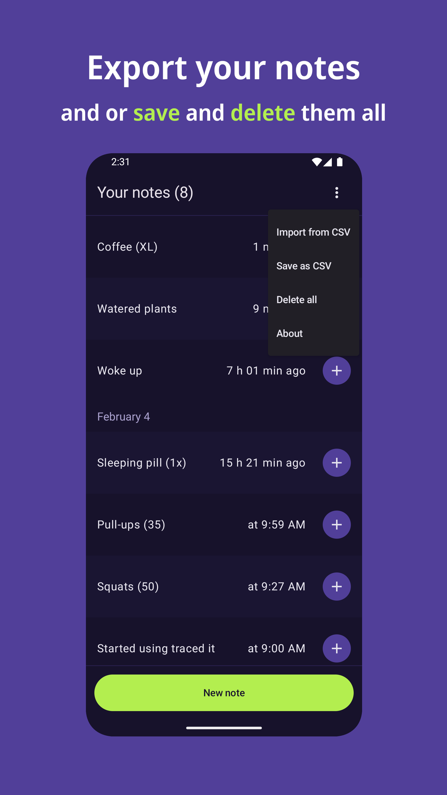

#  traced it

A simple app for short text notes, with a prominent timestamp for each entry.
Add quantities to your notes using preset formats (S, M, XL, 1/4, 1/2, 3/4) or
custom numbers.

The uncomplicated interface makes the app easy to use even when you’re busy or
distracted.

📢 **We’re looking for testers! If you use the Google Play store and would like
to help us, please submit this [Google
Form](https://docs.google.com/forms/d/e/1FAIpQLSe4O_-f0mjtfLFWXkf5zThnPeEb8hQU-sHt_HXwKbOc6X02eg/viewform?usp=header).**

[](https://f-droid.org/packages/app.traced_it/)
[](https://github.com/traced-it/traced-it-android/releases/latest/download/app.traced_it.apk)
[](https://apt.izzysoft.de/packages/app.traced_it)

## Perfect for

- Journaling
- Tracking daily routines
- Recording workouts
- Logging supplements and water intake
- Measuring cooking ingredients
- Noting simple lab results

## Features

- Add text notes with an optional amount (S, M, XL, 1/4, 1/2, 3/4, 5.813…).
- See all your notes with the time elapsed since you wrote each note.
- Tap the + button to add a new note with the same text as an existing note.
- Edit a note, copy it to clipboard, delete it, delete all notes.
- Export all notes as a spreadsheet file (CSV format) and import them.
- Search notes and export found notes.

## Privacy & security

- The app doesn’t use the internet at all – your notes are stored on your phone
  only.
- The app doesn’t access any information about you and doesn’t collect usage
  data.
- No ads
- Free and open-source

[](./fastlane/metadata/android/en-US/images/phoneScreenshots/1.png)
[](./fastlane/metadata/android/en-US/images/phoneScreenshots/2.png)
[](./fastlane/metadata/android/en-US/images/phoneScreenshots/3.png)
[](./fastlane/metadata/android/en-US/images/phoneScreenshots/4.png)

## APK signature

The APK released on GitHub and F-Droid is signed with a certificate with the
following SHA-256 fingerprint:

```
d102417bced85dfb23c49ec1e1915963d17cf3d4c028b754877943cc9b865aa9
```

## Contributing

We welcome your contributions! To help us organize the work, please start by
creating a [GitHub issue](https://github.com/traced-it/traced-it-android/issues)
for the bug or feature you'd like to work on.

To translate the app, register at
[Toolate](https://toolate.othing.xyz/projects/traced-it/), which is an instance
of the Weblate translation app that we use. Toolate will submit your translation
as a GitHub pull request.

## License

Distributed under GNU General Public License version 3 or later. See
[COPYING](./COPYING).
